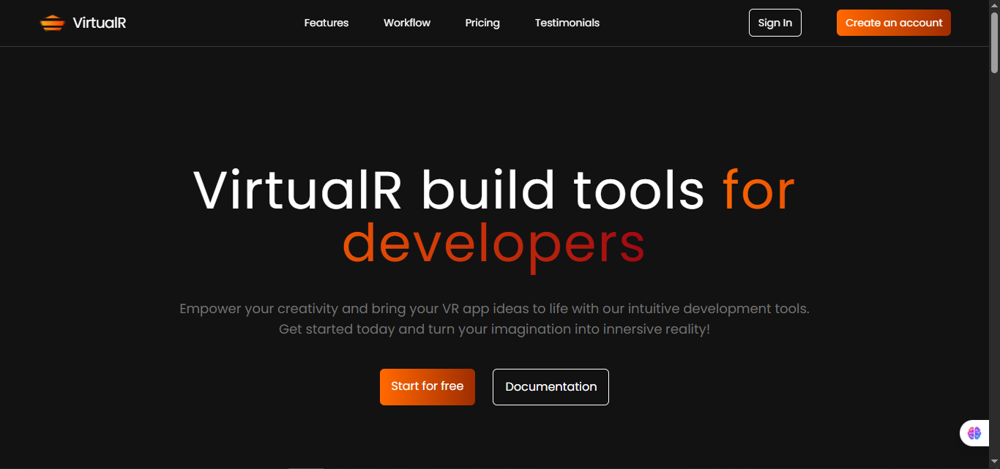
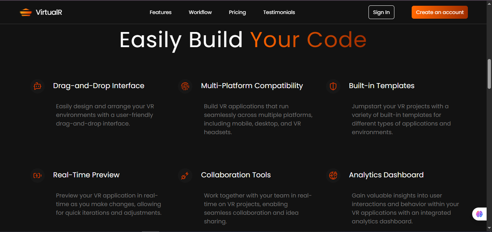
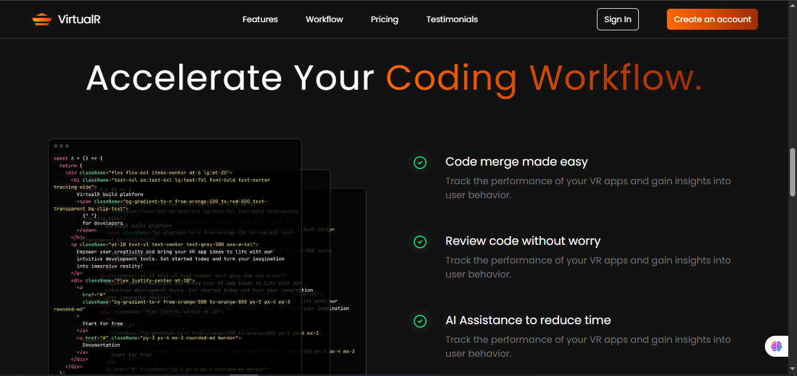
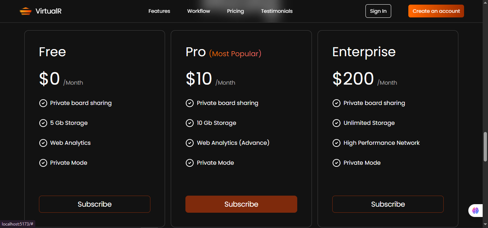
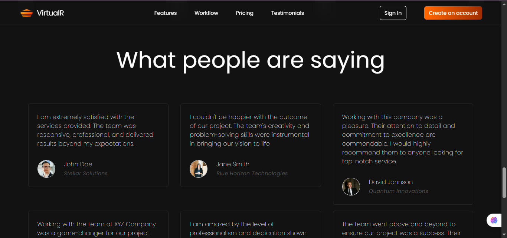
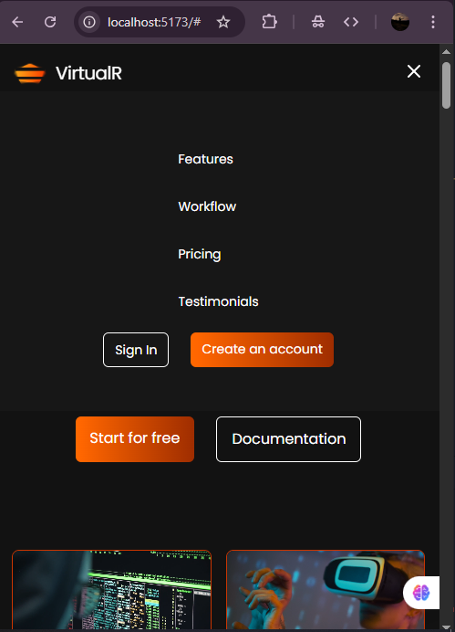
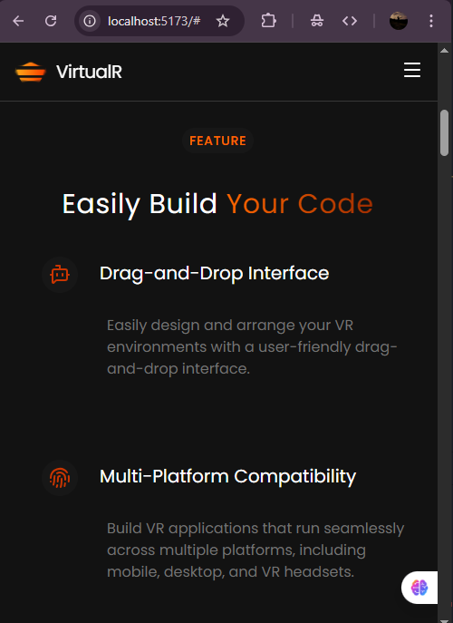
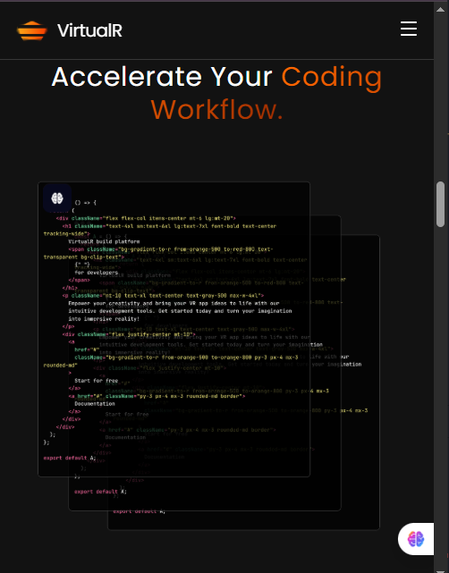
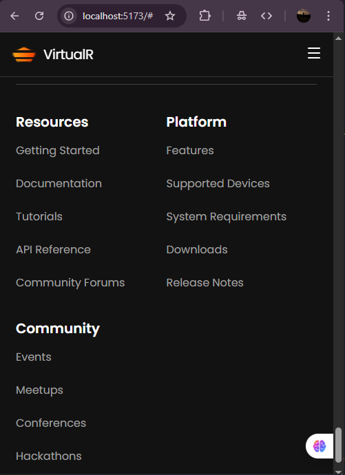

# VirtualR Website 🌐

A modern, responsive landing page website built using **React.js** and **Tailwind CSS**.  
This project focuses on clean UI, responsive design, and component-based architecture.

---

## 🌍 Live Demo

🔗 **Live Website:**  
https://saurabhpatil67.github.io/RL-virtuair-website-by-compiletab/

> ⚠️ Note: This project is currently hosted on GitHub Pages.  
> It will be migrated to **Vercel** for deployment soon.

---

## 📸 Project Screenshots

### 🖥️ Desktop View

  

  

  

  

  

---

### 📱 Mobile View

  

  

  

  

---

## 🛠️ Tech Stack

- ⚛️ **React.js**
- 🎨 **Tailwind CSS**
- ⚡ **Vite**
- 🎯 **Lucide React Icons**

---

## ✨ Features

- Fully responsive design (Mobile, Tablet, Desktop)
- Sticky navbar with mobile toggle menu
- Gradient text using `background-clip: text`
- Clean and reusable React components
- Modern UI inspired by SaaS landing pages
- Utility-first styling with Tailwind CSS

---

## 📚 Learning Source

This project was created by learning and implementing concepts from the  
**Compiletab** YouTube channel.

---

## 🧠 What I Learned

- Building reusable components in React
- Conditional rendering and state handling
- Responsive layouts using Tailwind CSS
- Mobile-first design approach
- Structuring a real-world frontend project

